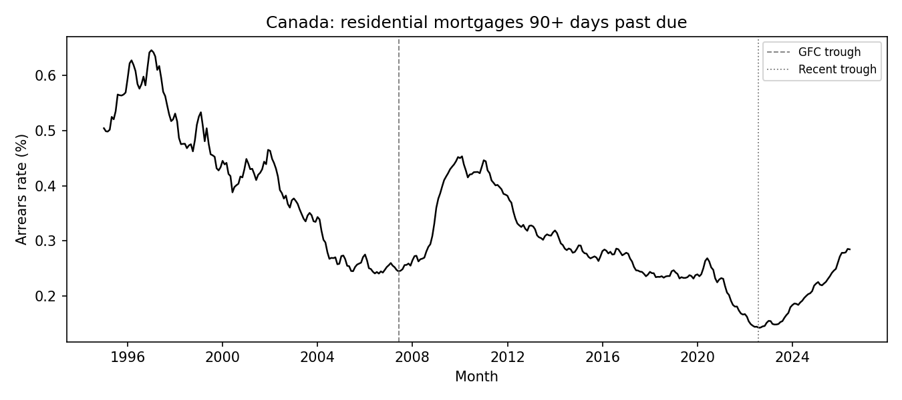
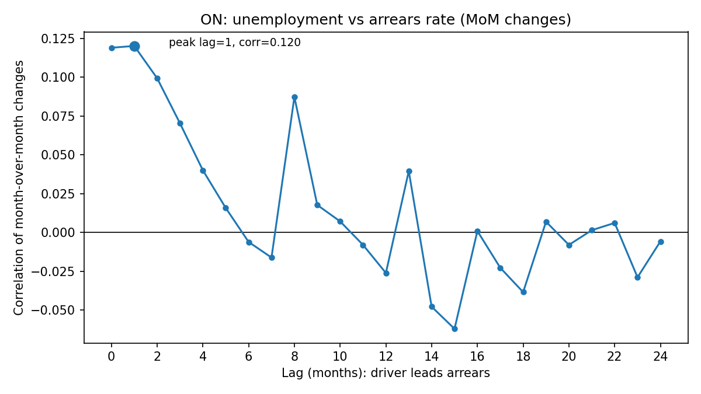
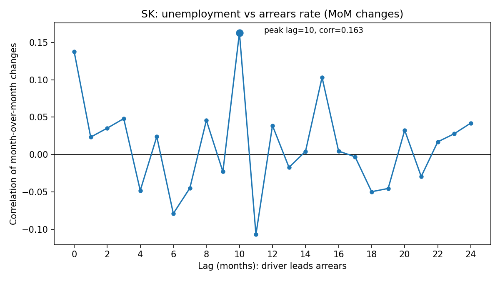
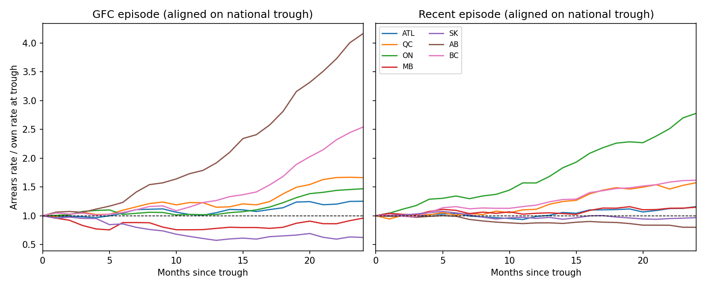

# Canadian Mortgage Arrears: Macro Drivers by Province

Clean provincial panel of CBA residential mortgages **90+ days past due** (1995–present), joined to StatCan unemployment and Bank of Canada rates, to measure how labour-market and rate moves line up with arrears.

**Spec:** [PROJECT_BRIEF.md](PROJECT_BRIEF.md)

---

## Research questions and answers

### 1. What is the lead time between provincial unemployment and arrears?

Using cross-correlation of **month-over-month changes** at lags 0–24, the panel regression (province fixed effects, median lag = **2 months**) finds: a one percentage point rise in provincial unemployment is associated with about a **5.2 basis point** rise in the arrears rate **2 months** later (HC1 robust standard errors; N = 2,548). Cross-correlations themselves are modest (~0.12–0.16 at provincial peaks), so this is an association, not a tight causal claim.

### 2. Does the lead time differ by province?

Yes. Peak unemployment lags (max |correlation| of MoM changes):

| Region | Peak lag (months) | Correlation |
|---|---:|---:|
| ATL | 0 | 0.13 |
| BC | 0 | 0.16 |
| ON | 1 | 0.12 |
| QC | 2 | 0.11 |
| AB | 8 | 0.16 |
| SK | 10 | 0.16 |
| MB | 23 | −0.12 |

Ontario and the coasts respond within 0–2 months; Saskatchewan and Alberta peak later. Manitoba’s peak is a weak **negative** correlation at a long lag — treat with caution.

### 3. Is the recent episode like 2008–2010?

**Not really, and it is slower on the national speed metric.** National arrears troughs: **2007-06** (GFC window) and **2022-08** (recent). From trough to ~18 months later, the national arrears rate rose by **~8.6 bp** after the GFC trough vs **~4.4 bp** after the recent trough. Provincially, the GFC rise was Alberta-led; the recent rise is **Ontario-led**, with Alberta flat to down.

The reporting **bank panel also differs**: Manulife (2004), Laurentian (2010), Equitable (2020) joined between or around these episodes.

---

## Figures

### 1. Canada arrears rate, 1995–present



### 2. Ontario: unemployment vs arrears (MoM correlation by lag)



### 3. Saskatchewan: unemployment vs arrears (MoM correlation by lag)



### 4. GFC vs recent episodes (aligned on national trough)



Values are each province’s arrears rate divided by its own rate at the national trough month (1.0 = unchanged).

---

## Data traps handled

- **Two-column PDF** — each page has 1995–2010 on the left and 2011–present on the right; parsing uses word x-coordinates so decades are not mixed.
- **Suppressed Territories** — `*` → null, not zero.
- **Trailing blank months** — future dates with no totals are dropped.
- **Split thousands** — pdfplumber sometimes splits `2,618` into `2` + `,618`; fragments are rejoined.
- **Rounded printed %** — analysis uses recomputed `arrears / total` at full precision.
- **Canada sum** — the source PDF is not perfectly additive every month; tests require no gap above 3% and ≥99% of months within 0.3% (verified against raw tokens for outliers).

---

## Limitations

1. **Changing bank panel** — Manulife (2004), Laurentian (2010), Equitable (2020) join the CBA counts; level series jump when coverage expands. Breaks are recorded in the `breaks` table, not smoothed away.
2. **Atlantic and Territories aggregation** — CBA reports Atlantic as one block; Yukon is folded into BC and NWT/Nunavut into Alberta in the source footnotes; Territories arrears are often suppressed. Atlantic unemployment is a labour-force-weighted average of NL, PE, NS, NB. No Territories unemployment series is invented.
3. **90-day arrears is a lagging indicator** — it misses borrowers who received amortization extensions, payment deferrals, or other relief instead of going 90+ days past due (especially relevant post-2020).
4. **National rates applied to provinces** — policy rate and 5-year yields are Canada-wide; they do not vary by province in this panel.
5. **Series start dates** — overnight target monthly series begins 1996; 5-year benchmark yield begins 2001. Early nulls are missing source history, not join errors.
6. **Econometrics** — levels regression with province FE; SEs are HC1, not clustered (only seven provinces). Correlations and coefficients are associations.

---

## Reproduce

Python 3.11+:

```bash
python3.11 -m venv .venv
source .venv/bin/activate
pip install -r requirements.txt
```

| Step | Command |
|---|---|
| CBA PDF | `python src/fetch_cba.py` |
| Parse tests | `python -m pytest tests/test_parse.py -v` |
| StatCan ZIP | download [14100287-eng.zip](https://www150.statcan.gc.ca/n1/tbl/csv/14100287-eng.zip) into `data/raw/` |
| Build DB | `python src/build_db.py` |
| Lags | `python src/lags.py` |
| Regression | `python src/regression.py` |
| Episodes | `python src/episodes.py` |

Do not commit PDFs, CSVs, or `data/arrears.db` (gitignored).

### Locked Valet series

| Role | Code |
|---|---|
| Overnight target | `STATIC_ATABLE_V39079` |
| 5-year GoC yield | `BD.CDN.5YR.DQ.YLD` |
| Prime | `V80691311` |
| CPI YoY | `STATIC_TOTALCPICHANGE` |
